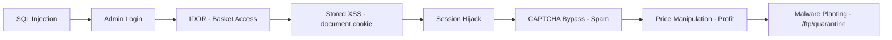

# 🛡️ Executive Summary – Advanced Web App Adversary Simulation (OWASP Juice Shop)

## 🎯 Objective

This project simulates a full-spectrum red team attack on the OWASP Juice Shop – a deliberately vulnerable modern web application – to demonstrate how real-world adversaries chain multiple OWASP Top 10 vulnerabilities to compromise user data, escalate privileges, and bypass business logic.

The simulation is designed to:

* Recreate **multi-stage attack chains**
* Highlight **critical vulnerabilities** and **misconfigurations**
* Apply **automated and manual testing techniques**
* Showcase **realistic threat actor behavior**

---

## 🧪 Environment Overview

| Component      | Description                                                       |
| -------------- | ----------------------------------------------------------------- |
| **Attacker**   | Kali Linux (Burp Suite, OWASP ZAP, Nikto, curl)                   |
| **Victim**     | Juice Shop (Node.js app) on Windows VM                            |
| **Tools Used** | Burp Suite, OWASP ZAP, SQLMap, curl, custom Python scripts |

---

## 🔓 Kill Chain Summary

---

## 🧠 Key Findings & Techniques

|  # | Vulnerability                           | MITRE Mapping                                 | Description                               |
| -: | --------------------------------------- | --------------------------------------------- | ----------------------------------------- |
|  1 | SQL Injection (Login as Admin)          | T1190 – Exploit Public-Facing App             | Gained unauthorized access                |
|  2 | IDOR (Basket Access)                    | T1203 – Exploitation for Privilege Escalation | Viewed another user's private data        |
|  3 | Path Traversal (`/ftp/acquisitions.md`) | T1005 – Data from Local System                | Extracted sensitive documentation         |
|  4 | XSS (document.cookie theft)             | T1056.001 – Input Capture                     | Stole session data via malicious script   |
|  5 | CAPTCHA Bypass (Feedback Spam)          | T1078 – Valid Accounts                        | Automated spam bypassing CAPTCHA          |
|  6 | Price Manipulation                      | T1565 – Data Manipulation                     | Made profit by submitting negative prices |
|  7 | Malware Plant in `/ftp/quarantine/`     | T1204.002 – Malicious File                    | Located potential malware file            |
|  8 | User Enumeration via Forgot Password    | T1589 – Credential Harvesting                 | Determined valid users by UI behavior     |
|  9 | Missing HTTP Security Headers           | T1505 – Server Software Compromise            | Detected lack of `CSP`, `HSTS`, etc.      |
| 10 | Automated Recon (OWASP ZAP Active Scan) | T1595 – Active Scanning                       | Identified 8 major alert categories       |

---

## 📊 Risk & Business Impact

> "This simulation reveals how multiple low-to-medium vulnerabilities can be **chained into a high-impact compromise**, mimicking how attackers operate in real-world breaches."

* Exposed user data, session tokens, and internal files
* Demonstrated full kill chain from initial access to impact
* Showcased automation for vulnerability detection
* Revealed poor input validation, access controls, and security hygiene

---

## 📁 Repository Highlights

* `findings/`: Walkthroughs with screenshots & MITRE mappings
* `automation/`: CAPTCHA bypass scripts
* `zap_report/`: OWASP ZAP scan results
* `README.md`: Attack summaries with embedded screenshots
* **Security Header Analysis** using `curl -I`

---

## 🚀 Takeaway for Interviewers

This project not only demonstrates technical exploitation skills but also reflects:

---

## 🎯 Key Takeaways

- Demonstrated ability to simulate real-world web application attacks using **OWASP Top 10 vulnerabilities.**
- **Chained multiple vulnerabilities** (SQLi → IDOR → XSS) to simulate full adversary kill chains.
- Performed **automated scanning** and interpreted ZAP reports to identify misconfigurations.
- Identified business-impacting risks like **admin login bypass, sensitive file access, and price manipulation.**
- Documented everything professionally in GitHub with screenshots, scripts, and remediation insights.

