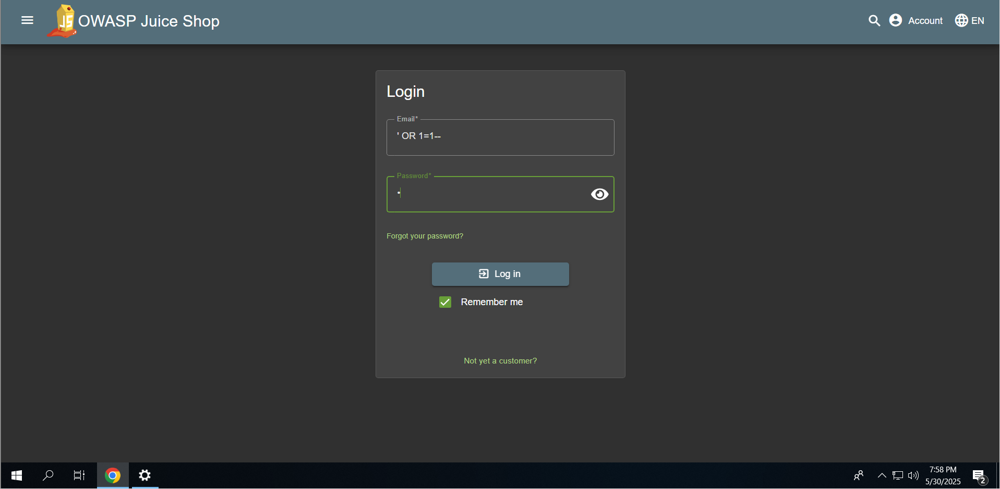
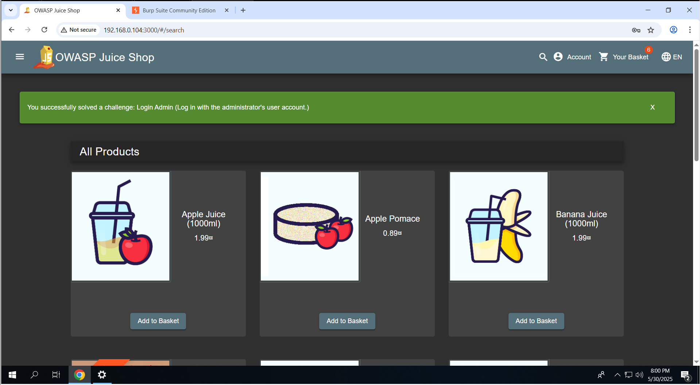

# 🛡️ 01 – SQL Injection: Admin Login Bypass

---

## ✅ Exploit Summary

**Vulnerability:** SQL Injection  
**Target URL:** `http://192.168.0.105:3000/#/login`  
**Injection Used:** `' OR 1=1--`  
**Authentication Role Bypassed:** Administrator

---

## 🔍 Steps to Reproduce

1. Navigate to the login page:  
   `http://192.168.0.105:3000/#/login`

2. Enter the following payload into the **email** or **username** field:
```

' OR 1=1--

```

3. Enter any random password (it will be ignored).

4. Click **Login**.

5. You will be logged in as the admin user due to unsanitized SQL query execution.

---

## 📸 Screenshots

### 1. Injection Entered



### 2. Admin Login Success



---

## 🔐 Vulnerability Impact

- **Authentication bypass:** Anyone can log in without valid credentials.
- **Privilege escalation:** Potential to gain administrator access.
- **Data breach risk:** Attackers can access user data, order history, and administrative controls.

---

## 🔁 Recommended Remediation

- ✅ Use **parameterized queries** or **prepared statements** (e.g., in SQLAlchemy, Sequelize, etc.).
- 🚫 Avoid direct string concatenation for building SQL queries.
- 🧪 Implement **input validation** and **output encoding**.
- 🔐 Enforce **least privilege** principles for login access.

---

## 🧭 Reference

- OWASP Top 10: **A1 - Injection**
- MITRE ATT&CK: **T1190 – Exploit Public-Facing Application**

---
