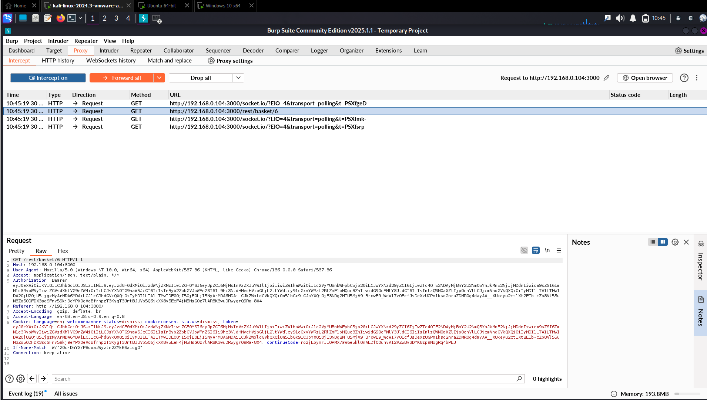
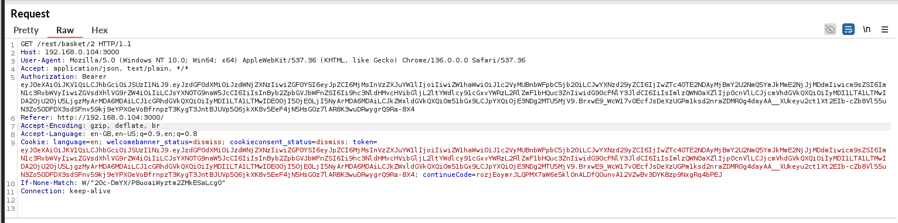
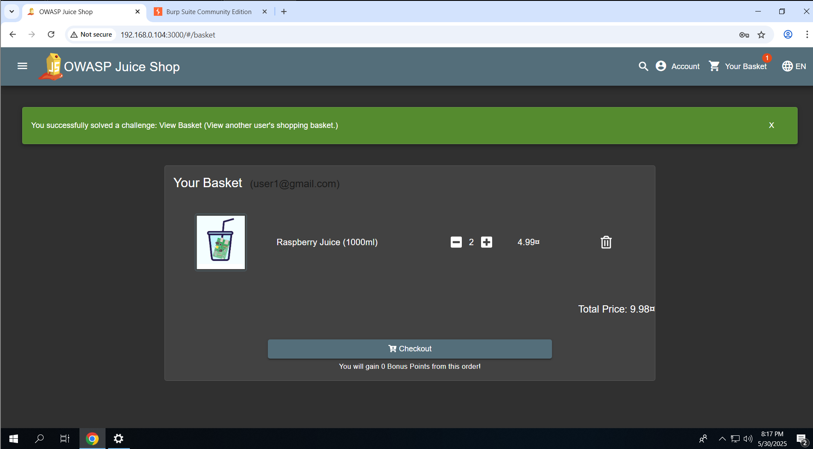

# 🔓 Finding 02 – Insecure Direct Object Reference (IDOR): Unauthorized Basket Access

---

## ✅ Exploit Summary

**Vulnerability:** Insecure Direct Object Reference (IDOR)  
**Target URL:** `http://192.168.0.105:3000/#/basket`  
**Impact:** View and manipulate another user's shopping basket  

---

## 🔍 Steps to Reproduce

1. Log in as any **non-admin** user and navigate to:  
   `http://192.168.0.105:3000/#/basket`

2. Intercept the request using **Burp Suite** or browser DevTools.

3. Locate a GET request like:
```

GET /rest/basket/<userBasketId>

```

4. Modify the `Basket` ID to another valid number (e.g., increment/decrement the ID).

5. Forward the request and observe the response.

---

## 📸 Screenshots

### 1. Initial Request in Burp



### 2. Modified Basket ID



### 3. Successful Unauthorized Access



---

## 🔐 Vulnerability Impact

- 🕵️ **Unauthorized Data Exposure:** Attackers can view shopping basket contents of other users.
- 📦 **Business Logic Abuse:** Potential manipulation of others' orders or prices.
- 🔄 **Mass Exploitation Risk:** Attack can be automated for user enumeration and data scraping.

---

## 🔁 Recommended Remediation

- 🔒 Implement **access control checks** on the server-side:
> Ensure that users can only access objects they own.
- 🧪 Use **object references tied to session/user identity**.
- 🚫 Never rely solely on IDs in URLs or client-side validation.
- 🛡️ Log and alert on suspicious access patterns (e.g., sequential ID scanning).

---

## 🧭 Reference

- OWASP Top 10: **A1 - Broken Access Control**
- CWE-639: **Authorization Bypass Through User-Controlled Key**

---

