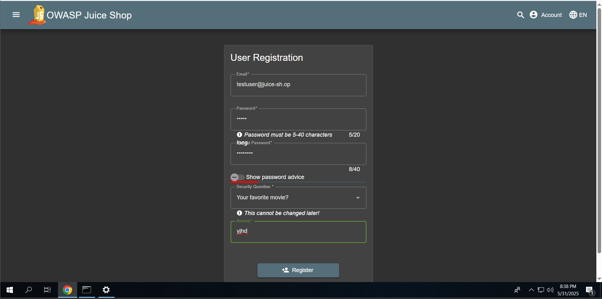
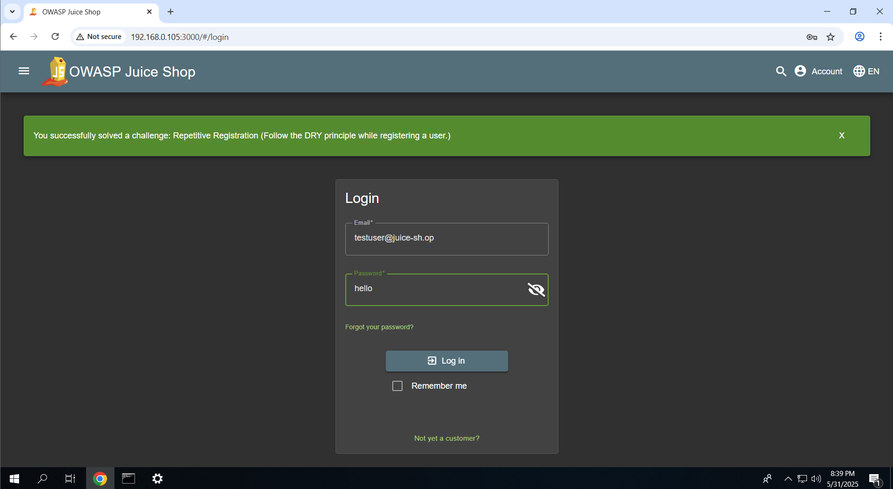

# 🛡️ 05 – Registration Logic Flaw: Bypassing Password Confirmation Validation

## 🔍 Summary

During user registration, the application fails to enforce password-confirmation match checks. This allows users to register even when the password and confirm password fields do **not** match—violating both **security validation principles** and the **DRY (Don't Repeat Yourself)** principle on the frontend.

> 💣 **Impact**: Bypassing password confirmation checks can lead to user confusion, account lockout, and denial of service. It also demonstrates a critical **client-side validation dependency** without secure server-side enforcement.

---

## ✅ Exploitation Steps

### 1️⃣ Accessed Registration Page  
Visited:
```

[http://192.168.0.105:3000/#/register](http://192.168.0.105:3000/#/register)

```

---

### 2️⃣ Entered Valid Registration Data  
- Email: `testuser@example.com`
- Password: `StrongPass123`
- Confirm Password: `StrongPass123`

🧠 **Observation**: The app visually validated the password match.

---

### 3️⃣ Manipulated Password Field Before Submission  
Before clicking "Register", **modified the Password field** to `ChangedPass456`, making it **mismatch** with Confirm Password.

🧪 Expected Behavior: Validation should reject this mismatch.  
✅ Actual Behavior: The user was still registered and logged in successfully.

---

### 4️⃣ Logged in with Final Password Only  
Logged in using only the **updated password** (`ChangedPass456`)—proving the backend ignored the confirmation value entirely.

---

## 📸 Screenshots

<div style="display: flex; flex-direction: column; gap: 10px;">





</div>

---

## 💣 Vulnerability Impact

| Issue | Consequence |
|-------|-------------|
| ❌ No Server-Side Confirmation Check | Security logic relies entirely on client validation |
| 🧑‍🔧 Weak Input Validation | Users may unknowingly lock themselves out of their accounts |
| 🎯 Abuse Vector | Automated account registration and fuzzing of password logic |
| 📉 Poor UX and Security Trust | Breaks user expectations and weakens authentication flow integrity |

---

## 🎯 OWASP Mapping

| ID       | Category                       |
|----------|--------------------------------|
| A01:2021 | Broken Access Control           |
| A05:2021 | Security Misconfiguration       |

---

## 🔐 Remediation Recommendations

| Action | Description |
|--------|-------------|
| ✅ Enforce password confirmation server-side | Reject registration if password and confirm password fields mismatch |
| 🧪 Apply full-stack validation | Validate inputs on both client and server layers |
| 🛡️ Lock frontend form after initial validation | Prevent post-validation changes via JavaScript or dynamic form monitoring |
| 🔍 Add backend test cases | Include negative test cases for mismatched password scenarios |

---

## 🧠 Key Takeaway

Security should **never rely solely on frontend validation**. This vulnerability reflects a common mistake—**trusting the client** to enforce critical logic that must be verified server-side.

---

