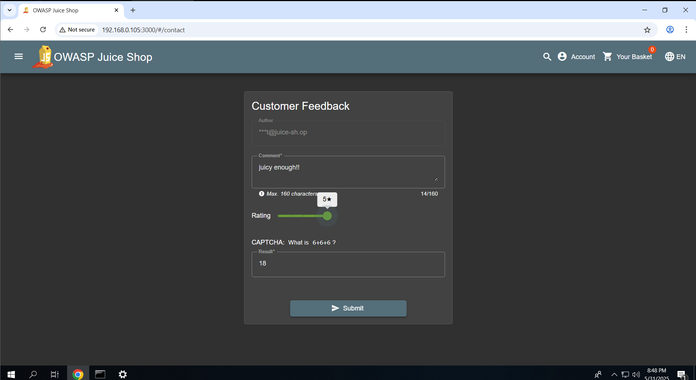
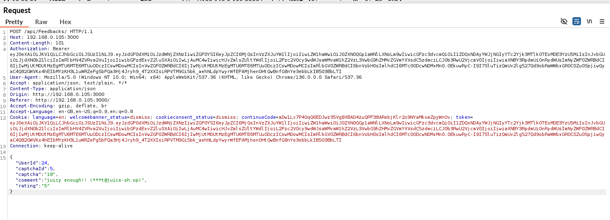
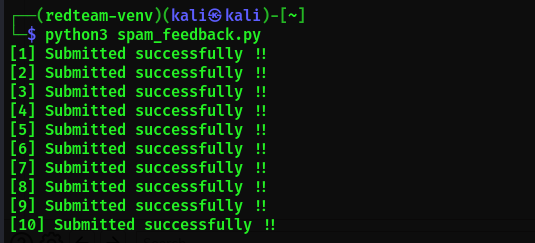
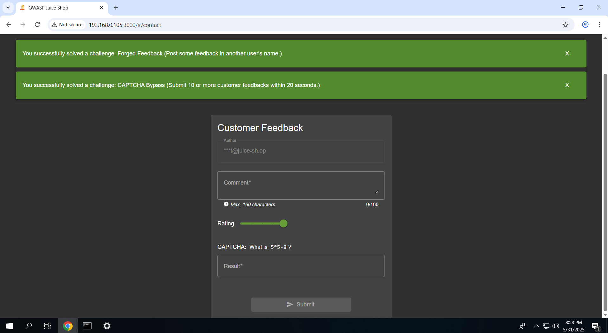

# 🛡️ 06 – CAPTCHA Bypass & Feedback Spam Automation

## ✅ Exploitation Steps

1. **Accessed the Feedback Form**  
   URL: [`http://192.168.0.105:3000/#/contact`](http://192.168.0.105:3000/#/contact)  
   The page includes a feedback form and a visible CAPTCHA.

2. **Intercepted Feedback Request**  
   Captured the HTTP POST request to `/api/Feedback/` using Burp Suite, noting that:
   - The CAPTCHA token field was present but not validated server-side.
   - Request did **not** enforce rate-limiting or CAPTCHA verification.

3. **Automated the Spam Submission**  
   Wrote a Python script to:
   - Forge feedback messages (e.g., `Fake Promo`, `Injected Review`)
   - Send 10+ requests rapidly in ~20 seconds
   - Completely bypass CAPTCHA and rate limits

4. **Forged Feedback Appeared in UI**  
   Verified spam content appeared on the front-end, proving a complete bypass and automation success.

---

## 📸 Screenshots

---

## 🔐 Vulnerability Impact

- 🤖 **CAPTCHA Ineffectiveness**: Fails to prevent bot/spam abuse.
- 💬 **Reputation Risk**: Public feedback page can be flooded with malicious or fake content.
- 🧨 **Potential for Scripted Attacks**: Could be chained with XSS or social engineering.

---

## 🔁 Remediation Recommendations

- ✅ Enforce **server-side CAPTCHA validation** before accepting submissions.
- 🚫 Implement **rate limiting & anti-automation controls** on feedback APIs.
- 🛡️ Use **CSRF tokens** and **IP throttling** to slow automated submissions.
- 📊 Log and monitor suspicious request bursts.

---

> A single CAPTCHA means nothing without server validation. Bots aren’t fooled by visuals—your backend must validate all user interactions.

