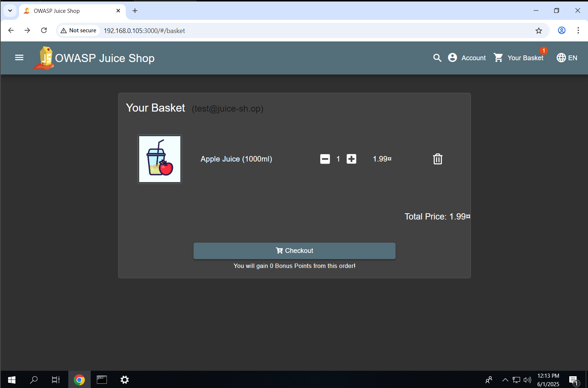
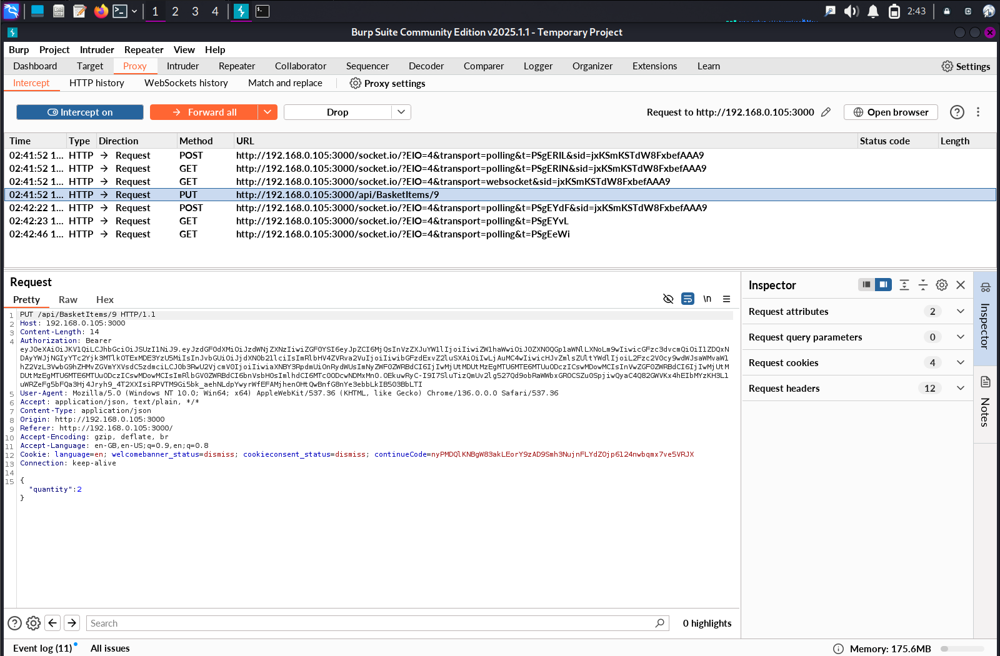
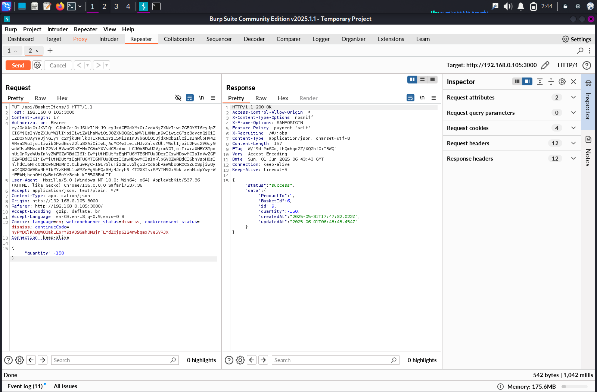
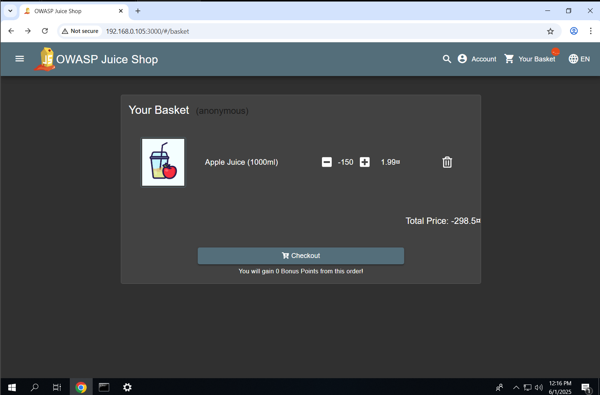
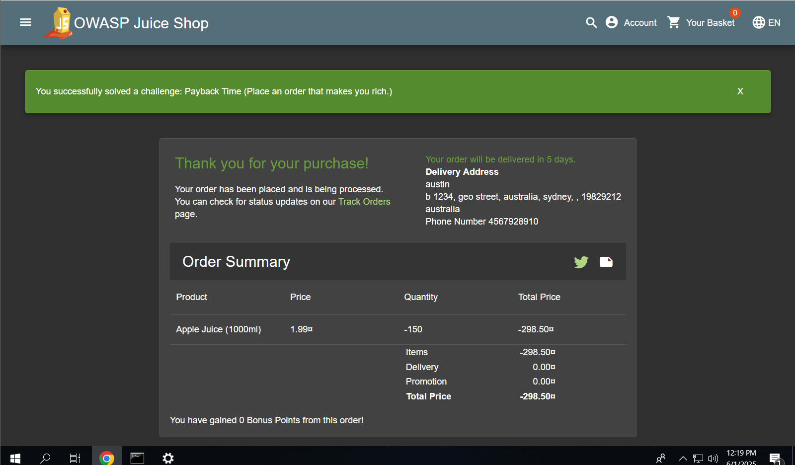

# 🛡️ 07 : Price Manipulation via Negative Quantity

## ✅ Exploitation Steps

1. **Viewed Original Basket Contents**  
   URL: [`http://192.168.0.105:3000/#/basket`](http://192.168.0.105:3000/#/basket)  
   The basket displayed a legitimate product with quantity = 1 and its normal price.

2. **Intercepted PUT Request in Burp Proxy**  
   While updating the product quantity, a PUT request to the `/api/basket/{id}` endpoint was captured.

3. **Modified Request in Repeater – Quantity = -150**  
   The `quantity` field was manually set to `-150`, a clearly invalid input.  
   Example modified request body:
   ```json
   {
     "quantity": -150
   }


4. **Observed Basket Total Turn Negative**
   The total basket price dropped dramatically (e.g., to `-298.50 `) — effectively giving *money back* on checkout.

5. **Placed the Order with Manipulated Price**
   Continued the normal checkout process using the tampered basket.

6. **Order Successfully Placed**
   The system accepted the manipulated total without any validation, finalizing the order with a negative amount.

---

## 📸 Screenshots

<div style="display: flex; flex-direction: column; gap: 10px;">











</div>

---

## 🔐 Vulnerability Impact

* 💸 **Financial Fraud Risk**: Users can manipulate item prices to gain monetary advantage or place orders with negative totals.
* 📉 **Business Integrity Threat**: Enables theft of goods, financial loss, and customer trust erosion.
* 🛠️ **Complete Lack of Validation**: Backend fails to validate user input before processing price-critical logic.

---

## 🔁 Remediation Recommendations

* 🔒 **Implement strict server-side validation** for input fields, especially for quantity and price.
* 🚫 Reject negative or zero values where logically inappropriate.
* 🧾 **Recalculate price on the server side** rather than trusting client-submitted totals.
* 🔍 Perform **regular parameter tampering and logic flaw testing** as part of QA and security reviews.

---

> Never trust price-related inputs from the client side. Logic flaws are the silent killers of web application security.

