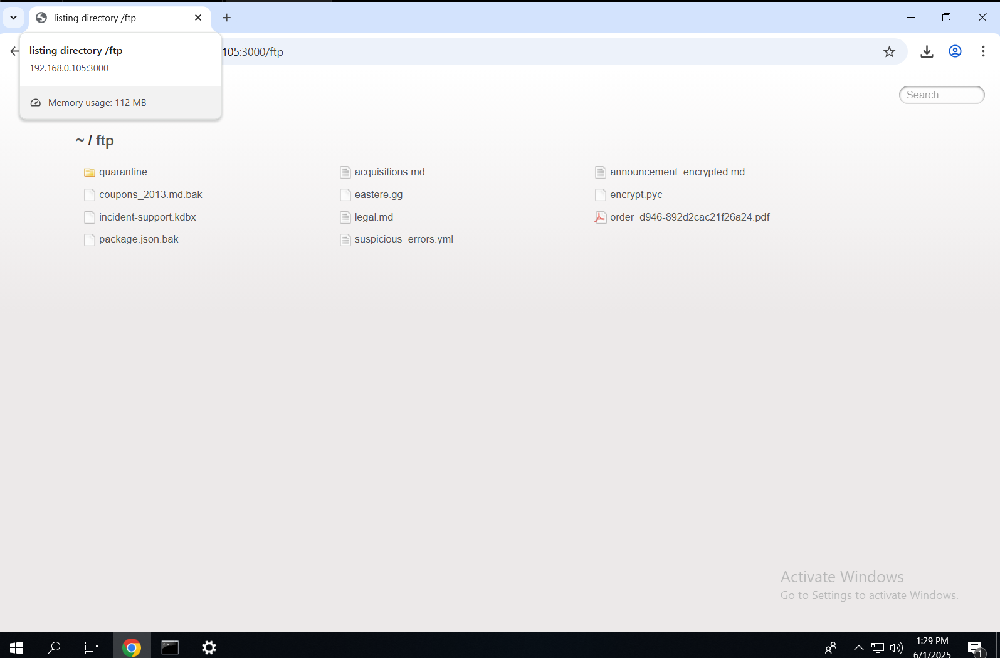
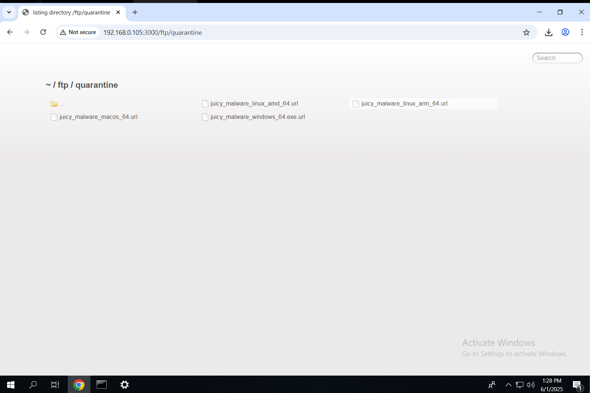

# 🛡️ 08 – Exposed Malware via Unrestricted FTP Access

## ✅ Exploitation Steps

1. **Navigated to the Publicly Accessible FTP Endpoint**  
   URL: [`http://192.168.0.105:3000/#/ftp`](http://192.168.0.105:3000/#/ftp)  
   This page lists downloadable `.md` files from a pseudo-FTP folder exposed to the frontend.

2. **Discovered `/ftp/quarantine` Directory with Malware Samples**  
   Upon browsing deeper, a subdirectory named `/ftp/quarantine` was accessible directly in the browser.  
   It revealed links to suspicious `.exe` files — likely malware samples or infected quarantined items.

---

## 📸 Screenshots

---

## 🔐 Vulnerability Impact

- 🦠 **Malware Distribution Risk**: Public access to `.exe` files may lead to accidental or malicious downloads.
- ⚠️ **Reputation Damage**: Hosting malware on a production-facing app damages credibility and violates platform policies.
- 🔍 **Indicates Poor Access Control**: Suggests that internal folders (e.g., quarantine) lack necessary restrictions or oversight.

---

## 🔁 Remediation Recommendations

- 🔒 **Restrict access to sensitive or internal folders** like `/ftp/quarantine` through proper server configurations.
- 🛡️ **Remove or quarantine malware samples outside the web-accessible directory** structure.
- 🧾 **Implement file type validation** and logging for all uploaded/downloaded resources.
- 🚫 **Disallow executable downloads** from publicly exposed paths unless intentionally hosted for trusted users.
- 🔍 Conduct **periodic audits** of publicly accessible endpoints.

---

> Exposing malware links from internal folders undermines the trust and security posture of any application. File access must be strictly controlled and monitored.
