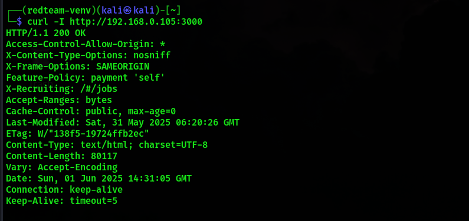

# 🛡️ Finding 10 – Missing Security Headers

> 💡 **Category:** Security Misconfiguration
> 🎯 **Target:** [`http://192.168.0.105:3000`](http://192.168.0.105:3000)

---

## 📌 Summary

The Juice Shop web server response lacks several industry-standard **security headers**, making it susceptible to a range of client-side attacks such as clickjacking, MIME sniffing, downgrade attacks, and content injection.

---

## 🧪 Steps to Reproduce

1. Run the following command from your **Kali Linux** terminal:

   ```bash
   curl -I http://192.168.0.105:3000
   ```

2. **Observe the HTTP response headers.**

---

## 📷 Evidence



Headers returned:

```
HTTP/1.1 200 OK
Access-Control-Allow-Origin: *
X-Content-Type-Options: nosniff
X-Frame-Options: SAMEORIGIN
Feature-Policy: payment 'self'
...
```

---

## ❌ Missing Critical Headers

| Header                      | Description                                          | Risk if Missing                 |
| --------------------------- | ---------------------------------------------------- | ------------------------------- |
| `Content-Security-Policy`   | Restricts sources of content like scripts and styles | High risk of **XSS**            |
| `Strict-Transport-Security` | Enforces HTTPS for all future connections            | Susceptible to **MITM attacks** |
| `Referrer-Policy`           | Controls referrer info sent in requests              | Can leak sensitive URLs         |
| `Permissions-Policy`        | Manages access to powerful browser features          | Allows abuse of APIs            |

---

## 🧠 Why This Matters

Security headers are part of **defense-in-depth** for web applications. Missing them:

* Leaves clients open to **client-side exploits**.
* Reduces **browser-enforced protections**.
* Sends a signal of weak **security maturity** to attackers.

---

## 🗺️ MITRE ATT\&CK Mapping

| Technique                           | ID        | Description                               |
| ----------------------------------- | --------- | ----------------------------------------- |
| 💥 Exploitation of Client Execution | T1203     | Client-side attacks via script injection  |
| 🔍 Passive Scanning                 | T1595.001 | Discovering misconfigurations via headers |

---

## 🛠️ Recommended Remediation

* ✅ Add the following headers in the web server configuration or app response layer:

  ```http
  Content-Security-Policy: default-src 'self'
  Strict-Transport-Security: max-age=31536000; includeSubDomains
  Referrer-Policy: no-referrer
  Permissions-Policy: geolocation=(), camera=()
  ```

* 🔒 Use an SSL certificate and redirect all HTTP traffic to HTTPS.

* 🧪 Test again with `curl -I` or tools like [securityheaders.com](https://securityheaders.com).

---


