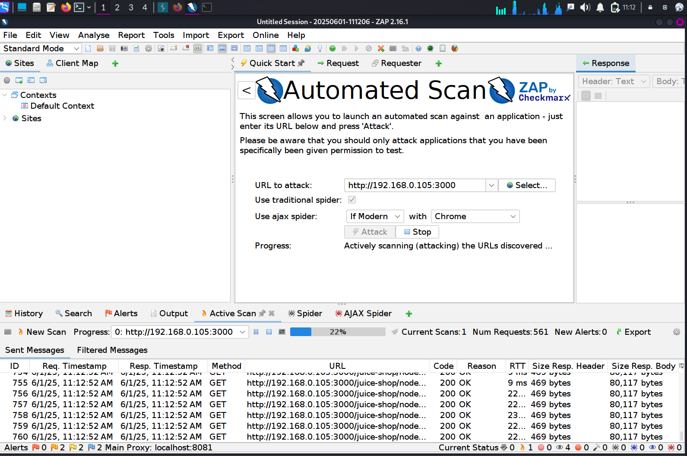

# 🤖 11 – Automated Vulnerability Scan with OWASP ZAP (Active Scan Only)

> 🛡️ **Category:** Automated Reconnaissance
> 🎯 **Target:** [`http://192.168.0.105:3000`](http://192.168.0.105:3000)

---

## 🧰 Tool: OWASP ZAP – Active Scan Mode

**OWASP ZAP** (Zed Attack Proxy) is a flagship OWASP tool used to automatically find security vulnerabilities in web apps during penetration testing. In this case, only the **Active Scan** was performed — meaning no crawling (spider) phase was run. The attack relied on the user-provided entry points.

---

## 🖼️ Screenshots

### ⚙️ Active Scan Running

---

## 📂 ZAP HTML Report

The full vulnerability scan output is included in this repo:

📁 [`zap_report/zap_scan_report.html`](../zap_report/zap_scan_report.html)

To view:

* Open the HTML file in a desktop browser (for best formatting)
* Supports sorting, filtering, and details per alert

---

## 🚨 Sample Vulnerabilities Identified

| 🔎 Issue                      | ⚠️ Risk Level | 🔍 Description                               |
| ----------------------------- | ------------- | -------------------------------------------- |
| Missing Security Headers      | Medium        | CSP and HSTS headers not configured          |
| Reflected XSS on Input Fields | High          | Unsanitized user input rendered in responses |
| Insecure Cookies              | Low           | Flags like `HttpOnly`/`Secure` not set       |
| Verbose Server Info           | Medium        | Stack traces or detailed error disclosures   |

---

## 🧠 MITRE ATT\&CK Mapping

| MITRE ID  | Name                       | Relevance                              |
| --------- | -------------------------- | -------------------------------------- |
| T1595.002 | **Vulnerability Scanning** | Automated tools to find web weaknesses |
| T1595.001 | **Service Identification** | Passive clues from HTTP responses      |

---

